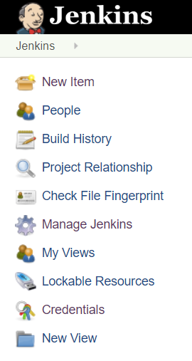
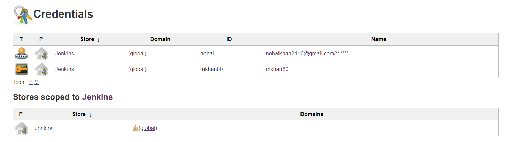
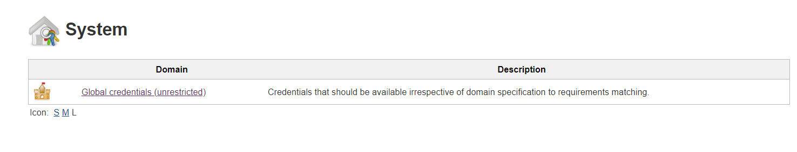
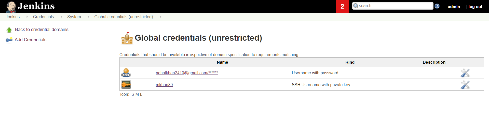
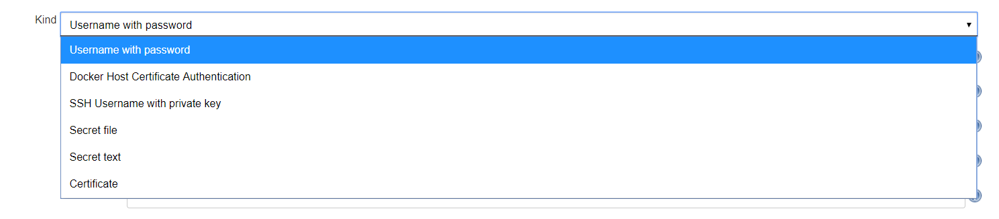
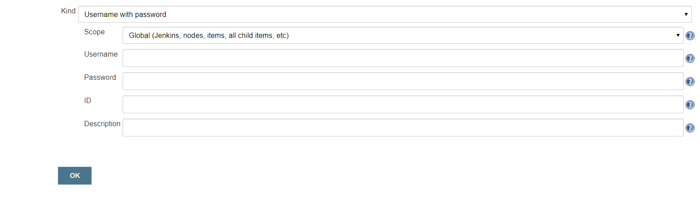

# Jenkins Credentials Setup

Open your Jenkins instance.

## *To View Existing Credentials:*

In the left panel you will find **Credentials** options.  

Click on the **Credentials** option, then you will be able to see all the available credentials configured on the Jenkins instance as below:

<!--  -->

You can use an existing **ID** from the available credentials in the Pipeline.

## *To Modify Existing / Add Credentials:*

As you have clicked on **Credentials** option earlier you can see **System** option under it in the left panel. Once you click on the **System** option you will be shown this page:

<!--  -->

By clicking the **Global credentials** option under **Domain** column you will redirected to the following page:

<!--  -->

By clicking on available credentials you will be able to `update, delete or move` the existing credentials.

You can create new set of credentials to be used in pipeline by clicking on **Add Credentials** option from left panel.

<!--  -->

You can select type of credentials you want to create as shown above.
Here, we are selecting `Username with password` type for demonstration.
But you can explore all the other available options.

<!--  -->

Here, you can select from **`Global or System`** scope for the credentials.

Provide `Username and Password` for the credential you want to create.

Provide `ID` for the credential this will be used as unique identifier to use the specified set of credentials that it points to.

Provide `Description` for the credential you are creating.

Once you fill all the required fields, click on `OK` button to save the credentials.

Now the `ID` you have provided while creating this set of credentials or an `ID` from available credentials can be used in the Pipeline.

